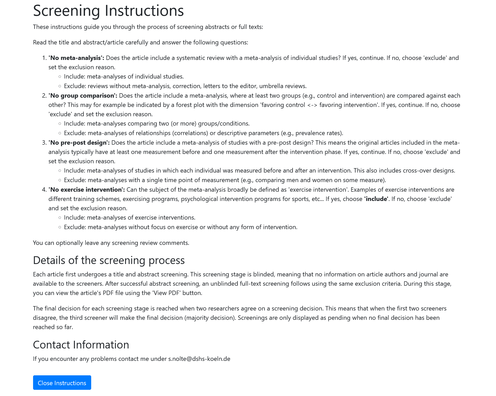
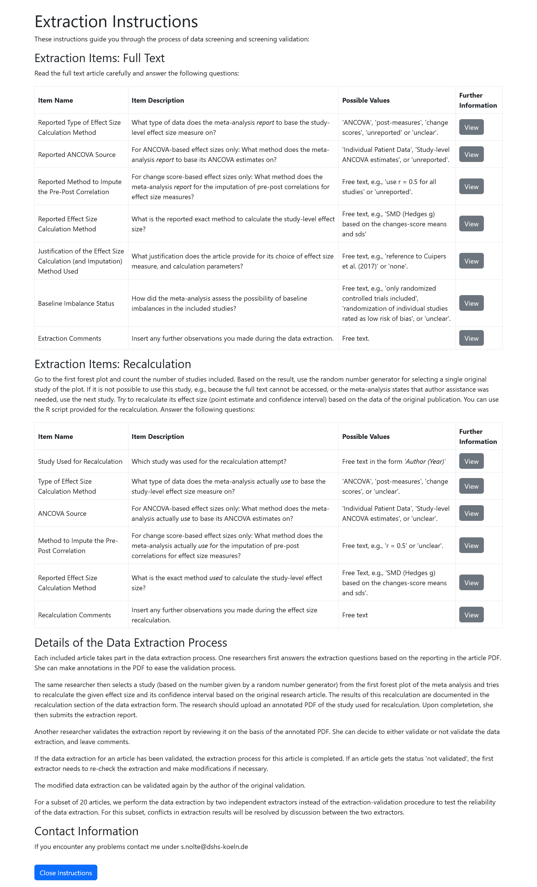

*This document includes the preregistration of the aforementioned project. It accompanies the 'Preregistration Summary' to provide more details of the planed work. This document follows the 'Inclusive Systematic Review Registration Form' [@vandenakker2023] and will be published on the Open Science Framework. This preregistration is licensed under a [CC-BY 4.0](http://creativecommons.org/licenses/by/4.0/) license.*

------------------------------------------------------------------------

## Meta-data

### Target discipline

Sport Science; Sports Medicine; Meta-Research

### Title

'Quantifying Change: Challenges and Strategies in Effect Size Determination for Exercise Intervention Meta-Analyses'

### Authors / Contributors (in alphabetical order)

Daniel Memmert^1^, Jenny Murphy^2^, Simon Nolte^1,3^, Oliver Jan Quittmann^3^, Robert Rein^1^, Theresa Siepe^3^

^1^Institute of Exercise Training and Sport Informatics, German Sport University Cologne ^2^School of Biological, Health and Sport Sciences, Technological University Dublin, Tallaght, Dublin, Ireland ^3^Institute of Movement and Neurosciences, German Sport University Cologne

### Tasks and Roles (preliminary)

Conceptualization: JM, SN, TS; Data curation: SN; Formal Analysis: SN; Investigation: JM, SN, OJQ, RR, TS; Methodology: JM, SN, OJQ, RR, TS; Project Administration: SN; Software: SN; Supervision: DM

## Review methods

### Type of Review

Methodological review, with additional analysis of an example case (see section 'Example case').

### Review Stages

Search, screening, data extraction

### Current review stage

Before search; the project has not started yet.

### Start date

12 Feb 2025

### End date

31 Jul 2025 (for data extraction)

### Background

Meta-analyses are frequently among the most cited research items in sports science and play a crucial role in guiding training practices and informing future research. However, methodological flaws in sports science meta-analyses are common [@kadlec2023; @hill2023]. A frequently overlooked but potentially important aspect in many exercise intervention meta-analyses is the method used to calculate effect sizes and their confidence intervals for studies with continuous outcomes and two groups (e.g., treatment and control) that include pre- and post-measurements.

For analyzing group comparisons with pre- and post-measurements, three methods are commonly used: ANCOVA, change score analysis, and post-measurement score analysis [@fu2016]. Each of these approaches varies in statistical power based on specific data characteristics and relies on different input variables. These input variables may be reported in the primary literature or need to be imputed for meta-analysis purposes. In the absence of universal guidelines, diverse approaches and imputation parameters may be employed in meta-analytical practice.

To date, no systematic review exists of the methods used to determine effect sizes in published exercise intervention meta-analyses. Since different analytical methods can lead to varying conclusions [@fu2016], the use of a variety of methods may indicate a lack of robustness in many meta-research findings within exercise science. A systematic review, coupled with a review of available methodological literature, could provide valuable recommendations for sports scientists on calculating effect sizes in exercise intervention meta-analyses.

### Primary research question

Which methods do researchers use for individual study effect size calculation in two-group pre-post meta-analyses of exercise interventions?

### Secondary research questions

How do researchers report and justify their used method of effect size calculation? Can changing the effect size calculation method change an analysis' conclusion?

### Expectations / hypotheses

No formal hypotheses are tested. We anticipate that researchers use a variety of methods in the published literature, which are sometimes incompletely reported or inadequately justified. We expect that the choice of method can influence the results of a meta-analysis, with different methods potentially yielding varying overall effect estimates and significance levels.

### Dependent variable(s) / outcome(s) / main variable(s)

Effect size determination method used (calculation method of the individual study effect sizes and their confidence intervals).

### Independent variable(s) / interventions(s) / treatment(s)

--- No independent variables used ---

### Additional variable(s) / covariate(s)

-   Effect size determination method reported
-   Justification for used method of effect size determination
-   Criteria/assessment of baseline imbalances for studies included in the meta-analysis (e.g. including only randomized controlled trials, qualitative rating of bias by missing randomization)

### Software

For search and data analysis: R version 4.4.0 (or newer) [@rcoreteam2023], `meta` package for R, version 8.0 (or newer) [@balduzzi2019], `rentrez` package for R, version 1.2.3 (or newer) [@winter2017].

For screening and data extraction processing we use a self-developed web platform based on PHP and MySQL that coordinates the screening and extraction process.

### Funding

--- No funding was received for this project ---

### Conflicts of interest

--- All researchers involved state that there are no conflicts of interest ---

### Overlapping authorship

--- No overlapping authorship is expected ---

## Search Strategy

### Databases

PubMed

### Interfaces

PubMed via the `rentrez` package [@winter2017].

### Grey literature

--- No grey literature will be searched ---

### Inclusion and exclusion criteria

Inclusion:

-   Only research published in one of the journals that published the 20 most cited meta-analyses in strength and conditioning research according to @kadlec2023.
-   Only research published in 2024 (date of print publication). Note that this may be expanded based on the number of included articles (see section 'Sampling and sampling size').
-   Only research that contains the phrase "Meta-Analysis" in its title.

### Query strings

`((("_JOURNALNAME1_"[Journal]) OR ("_JOURNALNAME2_)) AND (("2024/01/01"[Date - Publication] : "2024/12/31"[Date - Publication]))) AND (Meta-Analysis[Title])`

Replace `_JOURNALNAMEX_` by the name of each journal. Adjust date range if necessary (see section 'Sampling and sampling size')

### Search validation

We will determine the number of retrieved articles per journal and check the number against the number of articles matching the same criteria on the journal websites.

### Other search strategies

--- No further search strategies are used ---

### Procedures to contact authors

We will not contact any author during the review. We may contact authors during the case study (see section 'Example case').

### Results of contacting authors

--- Not applicable as we do not contact authors during the review ---

### Search expiration and repetition

We will conduct one single literature search in February 2025, which will not be repeated.

### Search strategy justification

Our aim is to map current methodological practices in exercise science meta-analyses. We include only recent articles, as developments in software and methodological knowledge may have led to changes in the literature, and we seek to depict the current state of the field. We search for meta-analyses within a subset of sports science journals that we expect to represent high-profile, current research, as indicated by their publication of highly cited meta-analyses in strength and conditioning research [@kadlec2023]. To focus on relevant studies, we limit our search to articles with the phrase "Meta-Analysis" in the title, assuming this terminology is standard for meta-analyses and helps filter out systematic reviews and original studies that do not contain a meta-analysis.

## Screening

### Screening stages

1.  Automated screening for abstracts

    *We remove articles that do not have an abstract, as these are very likely to be commments and corrections to meta-analyses. We also exclude articles with titles that begin with one of these phrases: "comment on", "letter to". "response to", "correction to".*

2.  Title and abstract screening

3.  Full-text retrieval and screening

    *If less than 100 results remain after step 2, we will extend the date range of the search by one previous year. This step may be repeated until a total of 100 results remain.*

4.  Data extraction

### Screened fields / blinding

During title and abstract screening, all additional information will be blinded to the person screening (screeners only see the article title and abstract, but not the journal, authors, or publication year). During full text screening, no blinding applies.

### Used exclusion criteria

See @fig-screen.

{#fig-screen fig-align="center"}

### Screener instructions

See @fig-screen.

### Screening reliability

All screening will be employed by two independent screeners (researchers involved in the project can assign themselves to screening any article for which the screening result is pending). Screening reliability will be calculated based as percentage of consensus in initial decision (include/exclude).

### Screening reconciliation procedure

If the two screeners disagree in their screening decision (include/exclude) a third independent researcher will screen the article and the final result will be based on the majority vote.

### Sampling and sampling size {#sec-samplesize}

We aim for a sample size of ≥100 articles to allow for a sufficient subset of current meta-analysis research in exercise science. If after all screening steps less than 100 articles remain, we will extend the search period by one previous year, until the threshold of 100 articles after final exclusion is meet.

### Screening procedure justification

We only include articles that match the research design we are investigating (meta-analyses of group comparisons with pre-post measurements) and the general topic of the project (exercise interventions). The work of two to three instructed independent screeners helps to ensure a reliable and valid screening procedure.

### Data management and sharing

Initial search results will be stored in a csv file containing data about the retrieved studies. Results of screening and data extraction will be stored in the database and will be later exported. All data and analysis code will be made publicly available under a CC-BY or MIT license on a GitHub repository.

### Miscellaneous screening details

When they later encounter errors in their screening, researchers can update their screening results. This will restart the screening process for the respective article.

## Extraction

### Entities to extract

See @fig-extract.

{#fig-extract fig-align="center"}

### Extraction stages

Data extraction will be conducted in three stages:

1.  **Full-text data extraction:** One researcher extracts the reported characteristics of each article.
2.  **Recalculation:** The same researcher attempts to recalculate an effect size for one study included in the meta-analysis. This study is selected with a pseudorandom number generator from the studies in the first forest plot that meets the screening criteria (i.e., a forest plot representing a pre-post group comparison design). If a different study is used for the reproducibility check, the reason is documented. If individual study effect sizes are not presented in the meta-analysis, recalculation is deemed infeasible. An R script with typical effect size measure formulas is provided to assist the recalculation.
3.  **Validation:** An independent researcher reviews the extraction results. Using an annotated article full text, this researcher decides whether to validate the initial data extraction or to suggest changes. If changes are suggested, the article returns to Stage 1, where the first extractor re-evaluates their extraction results.

### Extractor instructions

See @fig-extract.

### Extractor blinding

The researcher performing the validation is blinded to who performed the data extraction. This blinding may not apply if a researcher provides an annotated PDF with comments that show the name of the comment author. For the subset of studies that undergo an extraction reliability check, both extractors will work independently.

### Extraction reliability

We perform a validation stage to check for potential issues in the data extraction process. On a subset of the first 20 studies of data extraction, we perform an additional test of extraction reliability by having two independent researchers perform the data extraction (instead of one extractor and one validator). The two extractors will resolve conflicts by discussion.

### Extraction reconciliation

If, during the validation phase, researchers find the data extraction results erroneous, they choose not to validate the extraction and instead leave comments for the original extractor. The extractor can then update the data extraction, which will subsequently be re-evaluated by the same researcher who performed the initial validation.

### Extraction procedure justification

For economic reasons, a single researcher will perform the initial data extraction for most of the included meta-analyses. To minimize errors, we use an independent validation procedure. Additionally, we implement a recalculation stage to ensure that the reported analytical characteristics align with those actually applied in the included studies.

### Data management and sharing

The data extraction results will be stored in the data base back-end of the web platform and can be exported. The exported data will be made available on GitHub.

## Synthesis and quality assessment

As this is a methodological (scoping) review, we will not perform any systematic quality assessment of the included research. Instead we will describe the proportion (along with its 95%-confidence interval) of specific methods used for effect size determination. Additionally, we will calculate the percentage of studies with missing, incomplete, incorrect, or correct reporting of their methods. Reporting is defined as correct if the exact methods described lead to a successful recalculation of an individual effect size; incomplete means that further assumptions (about parameters and/or calculation methods) lead to a successful recalculation; incorrect if a recalculation given the reported methods is not possible; missing if no information on the used methods is given. The justifications provided for the chosen methods will be qualitatively assessed.

## Example case {#sec-example}

We will use an example meta-analysis that matches the review inclusion criteria to investigate whether different effect size determination methods can change the results of a meta-analysis.

### Study selection

For the case study, we use the article by @oliveira2024, as it matches our inclusion criteria and stands exemplary for meta-analyses of exercise interventions with a two-group pre-post design.

### Data Extraction

We will extract all reported summary measures from the original studies included in Fig. 4 of @oliveira2024. For missing summary measures (e.g., pre-post correlations or change score standard deviations) and individual data points, we will attempt to obtain the necessary information by extracting data from figures and/or contacting the authors of the respective articles. Some summary measures may also be available from the article by @rosenblat2025.

To derive a reasonable set of imputation parameters for pre-post correlations, we will extract these measures from a set of studies investigating exercise interventions targeting the same outcome parameter as @oliveira2024 (maximum oxygen uptake). This set of studies is drawn from the analysis conducted by @renwick2024. Specifically, we will extract or recalculate all pre-post correlations from the studies included in @renwick2024 to determine informed imputation parameters (e.g., the median pre-post correlation) and to establish a full distribution of correlations.

### Reanalysis

We will recalculate the meta-analysis presented in Fig. 4 of @oliveira2024 after correcting for the multiple counting of effect sizes. The reanalysis will involve combining groups when multiple control groups exist and selecting the most frequently studied exercise type when multiple exercise conditions are reported for a single study. Except for the method of effect size calculation, we will follow the analytical decisions made by @oliveira2024, such as using the standardized mean difference and a random-effects meta-analysis.

Our recalculation will apply different approaches to effect size calculation, including ANCOVA, post scores, and change scores with different imputation parameters. The specific set of methods employed will depend on data availability and the findings of the systematic review, which will indicate prominent methods in current research.

For each effect size calculation method, we will calculate the overall mean effect size and its 95%-confidence and prediction intervals. These results will be compared to evaluate the original research hypothesis by determining whether the confidence and prediction intervals overlap with an effect size of zero.

## References
